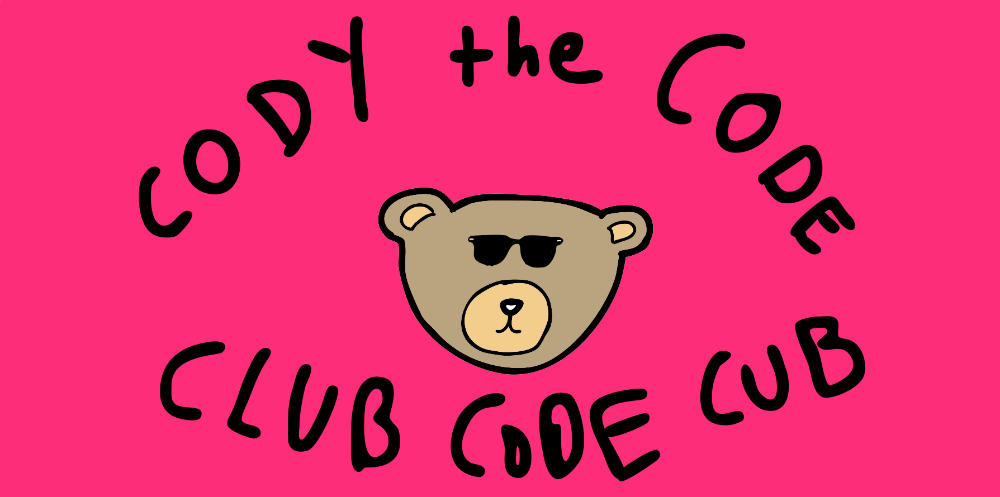

# Workshop 1: Personal Website

This workshop is for someone with 0 knowledge about coding to get a personal website started in less than an hour. 
We will teaching the basics of HTML and CSS, using the compiler Cloud9.


### Step 1: Setting up Cloud9
Before we begin coding, you must set up a Cloud9 account. This is a web based 
compiler where we will be writting all our code. Got to: https://hackclub.com/cloud9_setup. 

Enter your email and create a new account. Now create a new workspace and name it `PersonalWebsite` and 
select `Don't set a team for this workspace`. Make sure `public` and the template `HTML5` are selected. 

Click the green `Create workspace` button at the bottom.


### Step 2: Setting up the HTML File 

Start by creating an HTML file. Rick click the `PersonalWebsite` folder on the left sidebar and select `New File`.
Name the file `index.html`. Now double click on the file and it should open up.

Create the backbone of HTML file by typing the following:

```html
<!DOCTYPE html>
<html>
    <head>
    </head>
    <body>
    </body>
</html>
```

Make sure to save as you go along by clicking `file` and `save` or use the shortcut <kbd>Ctrl+s</kbd>. 

You can preview the page by clicking `Preview` on the top bar and then selecting `Live Preview File`.


### Step 3: Adding Text

Now you can add some text to your webpage. HTML uses a variety of elements to automatically format 
and identify text. There are mutlipe heading elements (`<h1>`, `<h2>`, `<h3>`, ..., `<h6>`) that create headers,
and there is also a paragraph element (`<p>`) to create paragraph text. 

Text is written inside the body and must be enclosed by a starting (ex: `<p>`) and ending tag (ex: `</p>`). 
Try this! An example is shown below.

```html
<!DOCTYPE html>
<html>
    <head>
    </head>
    <body>
        <h1>Roslyn Code Club</h1>
        <h2>by Jeffrey Yu</h2>
        <p>We are the Roslyn Code Club</p>
    </body>
</html>
```

### Step 4: Adding Photos

You can add a photo by using the `` tag. In this tag, you use attributes to control how the tag behaves. 


The attribute `srs` specifies the source of the image. This can be a URL or a file path. 


The attribute `alt` is used as an alternative if the image can not load for whatever reason, usually named 
whatever the image is suppose to be. 

The attribute `title` is the title of the image and is displayed as a tooltip when you mouse over the image.
This attribute can be used with different elements, too, such as `<p>`.

Try adding an image yourself! Google an image and copy it's sourse URL (done by right clicking and selecting 
`Copy Image Address`) An example is show below:

```html
<!DOCTYPE html>
<html>
    <head>
    </head>
    <body>
        
        <h1>Roslyn Code Club</h1>
        <h2>by Jeffrey Yu</h2>
        <p>We are the Roslyn Code Club</p>
    </body>
</html>
```

### Step 5: Adding Lists

Lists are just another text element.